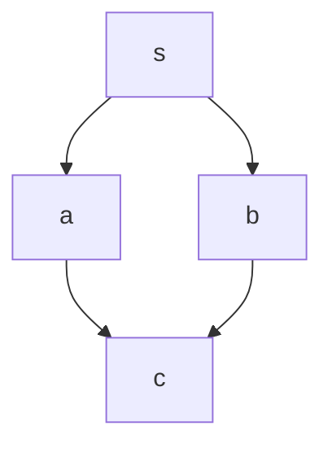

## 引言
在程序执行路径构成的复杂网络中，我们如何识别出那些无论执行流程如何选择都必须经过的“强制关卡”？这个关于程序内在结构的根本问题，由一个强大而优雅的概念——**支配（Dominance）**——来解答。一个程序的[控制流图](@entry_id:747825)（CFG）虽然描绘了所有可能的执行路径，但其纷乱的分支、循环和跳转往往会掩盖代码背后真正的、不可变更的依赖关系。理解这种“命令结构”，对于进行深度的[程序分析](@entry_id:263641)和高效的[代码优化](@entry_id:747441)至关重要。

本文旨在系统性地揭示支配理论的内涵及其实际应用价值。在第一章**“原理与机制”**中，我们将从“必经之路”的直观概念出发，深入探讨支配、直接支配点以及如何构建[支配树](@entry_id:748636)，揭示其如何将混乱的[控制流图](@entry_id:747825)转化为清晰的层级结构。随后，在第二章**“应用与[交叉](@entry_id:147634)学科联系”**中，我们将见证这一理论的强大威力，看它如何成为[静态单赋值](@entry_id:755378)（SSA）等现代[编译器优化](@entry_id:747548)的基石，并跨界影响到[计算机体系结构](@entry_id:747647)、数据库乃至游戏叙事等多个领域。最后，**“动手实践”**部分将提供一系列精心设计的问题，帮助你将理论知识转化为实践能力。

现在，让我们一同启程，首先探索支配关系的核心原理与机制，解开它作为[程序分析](@entry_id:263641)利器的秘密。

## 原理与机制

想象一下，你正在玩一个角色扮演游戏，为了到达最终的魔王城堡，你必须通过一系列的关卡。有些关卡是可选的，你可以绕道而行，但另一些，比如“迷雾森林”或“绝望峡谷”，是无论你选择哪条路线都必须经过的。在程序的世界里，也存在着同样的概念，我们称之为**支配（Dominance）**。

### 支配的本质：必经之路

一个程序的执行流程可以用一张地图来表示，我们称之为**[控制流图](@entry_id:747825)（Control Flow Graph, CFG）**。图中的每个地点是一个**基本块（basic block）**——一段连续执行的代码，而连接地点的有向路径则是可能的执行路线。程序的起点，也就是入口节点，好比是你的出生点。

那么，什么是支配呢？很简单：如果从程序的起点（我们称之为 $s$）出发，无论选择哪条路径去往节点 $n$，都必须经过节点 $d$，那么我们就说**节点 $d$ 支配节点 $n$**。这个节点 $d$ 就像是通往 $n$ 的一个必经关卡或强制安检站。

让我们来看一个简单的例子。一个程序从起点 $s$ 开始，有两个分支，分别通往 $a$ 和 $b$，然后这两条路又在 $c$ 点汇合。这形成了一个经典的“钻石”结构 [@problem_id:3645220]。

在这个图中，起点 $s$ 显然支配着 $a$、$b$ 和 $c$，因为要去这任何一个地方，你都得从 $s$ 出发。但是，节点 $a$ 支配 $c$ 吗？答案是不。因为存在一条路径 $s \to b \to c$，它完美地绕过了 $a$。同理，$b$ 也不支配 $c$。

这个简单的例子揭示了支配关系的本质：它是一种基于**所有路径**的全局属性。一个节点要成为支配者，它必须扼守住通往目标的所有道路，不留任何后门。

### 寻找“直接上司”：直接支配节点

一个节点可以有很多个支配者。在上面的例子中，$c$ 的支配者集合是它自己和 $s$。在更复杂的程序里，一个节点可能会被一长串的节点所支配。这就引出了一个更有趣的问题：在所有这些“上级”中，哪一个是你的“直接上司”？

我们把这个“直接上司”称为**直接支配节点（immediate dominator）**，记为 $\mathrm{idom}(n)$。它是在所有严格支配（即不包括节点自身的支配）$n$ 的节点中，离 $n$ “最近”的那一个。这里的“近”不是指路径长度，而是指支配链条上的关系。一个更精确的说法是：$\mathrm{idom}(n)$ 是那个被 $n$ 的所有其他严格支配者所支配的节点。

听起来有点绕口，但它的直觉意义非常清晰：$\mathrm{idom}(n)$ 是控制链条上紧邻 $n$ 的最后一个强制性关卡。

让我们通过一个具体的计算来感受一下。假设在一个[控制流图](@entry_id:747825)中，我们要寻找节点 $8$ 的直接支配节点 $\mathrm{idom}(8)$ [@problem_id:3645158]。我们首先列出所有从起点 $1$ 到 $8$ 的路径：
- 路径 1: $1 \to 2 \to 4 \to 5 \to 6 \to 8$
- 路径 2: $1 \to 3 \to 4 \to 5 \to 6 \to 8$
- 路径 3: $1 \to 2 \to 4 \to 5 \to 7 \to 8$
- 路径 4: $1 \to 3 \to 4 \to 5 \to 7 \to 8$

通过寻找这些路径的交集，我们发现支配节点 $8$ 的节点集合是 $\{1, 4, 5, 8\}$。除去 $8$ 本身，严格支配者集合就是 $\{1, 4, 5\}$。在这三个节点中，谁是 $\mathrm{idom}(8)$ 呢？我们看看它们之间的支配关系：任何到 $5$ 的路径都必须经过 $4$，任何到 $4$ 的路径都必须经过 $1$。所以，支配链是 $1 \to 4 \to 5$。节点 $5$ 是这条链上最末端、离 $8$ 最近的节点，因此，$\mathrm{idom}(8) = 5$。

### [支配树](@entry_id:748636)：揭示程序的真正骨架

现在，一个美妙的想法诞生了：如果我们为图中除了起点之外的每一个节点 $n$，都画一条从 $\mathrm{idom}(n)$ 指向 $n$ 的边，我们会得到什么？

答案是：一棵树！这棵树被称为**[支配树](@entry_id:748636)（Dominator Tree）** [@problem_id:3645201]。

这真是个了不起的结果。[控制流图](@entry_id:747825)本身可能是一个错综复杂的[有向图](@entry_id:272310)，充满了分支、合并和循环，看起来像一团乱麻。但[支配树](@entry_id:748636)却揭示了其背后隐藏的、清晰的层级结构。CFG 告诉我们程序**可以**怎样流动，而[支配树](@entry_id:748636)则告诉我们程序**必须**怎样流动。它不是程序的执行路径，而是程序的**命令结构**。

例如，在一个 CFG 中，起点 $s$ 分支到 $a$ 和 $b$，然后它们又在 $c$ [汇合](@entry_id:148680)。此外，图中还有一个从 $e$ 到 $c$ 的循环边 [@problem_id:3645206]。在 CFG 中，$c$ 看起来像是 $a$ 和 $b$ 的下游。但在[支配树](@entry_id:748636)中，$a$、$b$、$c$ 都是 $s$ 的直接孩子。为什么？因为要去 $c$，你可以走 $s \to a \to c$，也可以走 $s \to b \to c$。没有任何一个节点（除了 $s$ 和 $c$ 自己）是所有路径的必经之地。所以，$c$ 的直接上司就是程序的总入口 $s$。[支配树](@entry_id:748636)精准地捕捉到了这种并列关系。

更有趣的是，一个结构极其复杂的 CFG，其[支配树](@entry_id:748636)可能退化成一条简单的直线 [@problem_id:3645201]。这表明，尽管程序的执行路径千变万化，但其核心逻辑存在一个严格的、线性的强制顺序。

### 结构决定支配：控制流的游戏规则

支配关系完全由图的结构决定。一些常见的结构模式会产生可预测的支配关系。

**规则一：汇合点的支配者**

当多条路径在一个节点 $n$ [汇合](@entry_id:148680)时，$\mathrm{idom}(n)$ 是什么？一个重要的定理告诉我们：$\mathrm{idom}(n)$ 是它所有前驱节点在[支配树](@entry_id:748636)中的**最近公共祖先（Lowest Common Ancestor, LCA）**。

这个定理有一个非常实用的推论。假设节点 $n$ 有两个前驱 $p$ 和 $q$，并且我们已知 $p$ 支配 $q$。这意味着在通往 $n$ 的两条路中，一条是直接从 $p$ 来的，另一条从 $q$ 来的路径本身也必须经过 $p$。因此，$p$ 成了所有通往 $n$ 路径的必经之地，而 $q$ 不是。在这种情况下，$\mathrm{idom}(n)$ 就是 $p$ [@problem_id:3645163]。

我们可以用 `switch-case` 结构来将这个概念玩得更透彻 [@problem_id:3645182]。想象一个 `switch` 语句，分发到四个 case（$b_1, b_2, b_3, b_4$），最后在 $j$ 点[汇合](@entry_id:148680)。
- 如果每个 case 执行完后都直接跳转到 $j$，那么通往 $j$ 的四条路径只在 `switch` 的分发点 $s$ 汇合。因此，$\mathrm{idom}(j)=s$。
- 如果 case $b_1, b_3, b_4$ 都“fall-through”（穿透）到 $b_2$ 的代码，然后由 $b_2$ 跳转到 $j$，那么所有路径都在 $b_2$ 这个点上被强制[汇合](@entry_id:148680)。于是，$\mathrm{idom}(j)=b_2$。
- 如果 $b_1,b_4$ 穿透到 $b_2$, 而 $b_3$ 直接到 $j$，那么就存在一条绕过 $b_2$ 的路径。$b_2$ 不再是必经之地，[支配权](@entry_id:195104)交还给上一层的汇合点 $s$。因此，$\mathrm{idom}(j)=s$。

$\mathrm{idom}$ 就像是不同[路径分支](@entry_id:155468)在回溯时遇到的第一个共同的“老板”。

**规则二：局部改动，全局影响**

支配关系最迷人的特性之一是它的非局部性。在图的一个小角落里添加或删除一条边，可能会对遥远节点的支配关系产生颠覆性的影响。

让我们回到那个“双钻石”结构 [@problem_id:3645220]。图 $G_1$ 是两个钻石[串联](@entry_id:141009)而成：$s \to \{a,b\} \to c \to \{d,e\} \to t$。在 $G_1$ 中，$\mathrm{idom}(c)=s$，而 $\mathrm{idom}(t)=c$，因为 $c$ 是通往 $t$ 的必经之路。

现在，我们只增加一条边：从 $b$ 到 $e$ 的“快捷方式”。这个小小的改动，创造出了一条新路径 $s \to b \to e \to t$。这条路径华丽地绕过了节点 $c$！既然存在一条不经过 $c$ 的路， $c$ 就不再支配 $t$ 了。那么谁来支配 $t$ 呢？支配链向上回溯，我们发现，所有通往 $t$ 的路径（包括那条新的快捷方式）都必须经过 $s$。于是，$t$ 的直接支配者从 $c$ 一下子“跃迁”到了 $s$。这就像一次公司重组，仅仅因为增加了一条汇报路径，一个部门的直接领导就从经理变成了 CEO。

### 循环与迷宫：复杂结构中的支配关系

现实世界的程序充满了循环。`break` 和 `continue` 这样的跳转语句更是让控制流变得复杂。支配关系在这种情况下会如何表现？

考虑一个带有 `break` 语句的嵌套循环 [@problem_id:3645217]。`break` 会跳出外层循环，直接到达循环体之后的代码块 $B_2$。那么 $\mathrm{idom}(B_2)$ 是谁呢？$B_2$ 有两个入口：一个是外层循环条件不满足时的正常退出（来自循环头 $B_1$），另一个是内部的 `break` 跳转（来自 $B_5$）。分析所有路径可以发现，无论如何，要到达 $B_2$ 都必须经过外层循环的头部 $B_1$。因此，$\mathrm{idom}(B_2)=B_1$。这个结果非常直观：要“离开”一个循环，你首先必须“进入”过它。循环头是整个[循环结构](@entry_id:147026)的支配者。

更棘手的是所谓的**不可规约图（irreducible graphs）**，这通常是由 `goto` 等非结构化跳转造成的，它会导致循环有多个入口。很多人会误以为在这样的“意大利面条”代码中，支配关系会失效。但事实恰恰相反，支配的定义在这里依然坚如磐石，并能帮助我们理清头绪。

在一个具有双入口（$h_1, h_2$）循环的图中 [@problem_id:3645153]，我们仍然可以根据“所有路径”的定义来确定支配关系。
- 对于入口 $h_1$，存在一条路径 $s \to h_2 \to \dots \to h_1$，绕过了其他所有可能的支配者，所以只有 $s$ 支配 $h_1$，即 $\mathrm{idom}(h_1)=s$。对 $h_2$ 同理。
- 对于循环体内部的节点 $x$（其唯一前驱是 $h_1$），它的直接支配者就是 $h_1$。这意味着，一个节点的直接支配者完全可以和它自身位于同一个循环之内！这打破了许多人的直觉，也正展现了支配理论的严谨与普适之美。

### 不可达之境：定义的边界与现实

最后，让我们来思考一个哲学问题：对于一段永远不会被执行到的代码（unreachable code），它的支配者是谁？[@problem_id:3645198]

- **数学家的视角**：从纯粹的逻辑定义出发，“所有从起点到节点 $u$ 的路径都包含 $d$”这个命题，当从起点到 $u$ 的路径集合为空时，是**[空真](@entry_id:262024)（vacuously true）**的。这意味着，图中的**每一个节点**都支配着不可达的节点 $u$！但这会带来一个悖论：既然所有节点都是它的严格支配者，那么就不存在一个“唯一的”被其他所有支配者支配的节点。因此，在纯粹的定义下，$\mathrm{idom}(u)$ 是**未定义的**。

- **工程师的视角**：在实践中，编译器工程师会觉得这种讨论很无聊。如果一段代码永远执行不到，那它就是“死代码”，在进行分析之前通常就会被清理掉。像 **Lengauer-Tarjan** 这样高效的[支配树](@entry_id:748636)计算算法，第一步就是从起点开始进行[深度优先搜索](@entry_id:270983)，这个过程天然地忽略了所有不可达的节点 [@problem_id:3645198]。因此，对于实际的编译器来说，不可达节点根本不会出现在[支配树](@entry_id:748636)中，讨论它的 $\mathrm{idom}$ 也就没有意义。

这种在纯粹数学定义与工程实用主义之间的差异，完美地体现了计算机科学的魅力。我们从一个简单直观的“必经之路”概念出发，构建了一套能够揭示程序内在结构的强大理论，它甚至能驯服最复杂的[控制流](@entry_id:273851)，最终，我们还要学会在理论的边界处做出明智的、符合现实需求的抉择。这趟从直觉到严谨、再回归实用的旅程，正是科学发现的缩影。